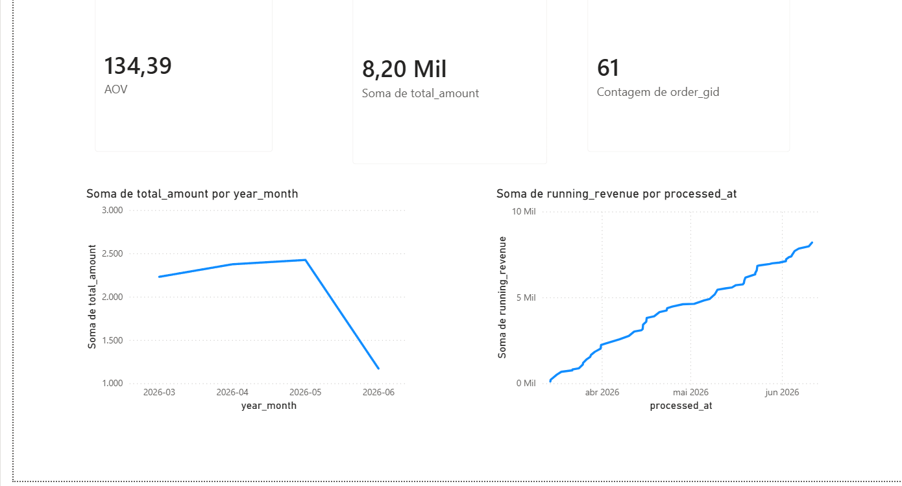
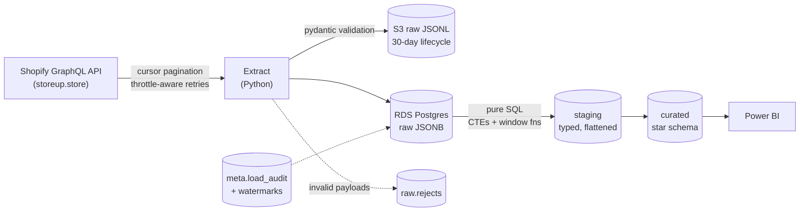

# E-commerce Data Warehouse

End-to-end ELT pipeline against a **live Shopify store**: GraphQL extraction → S3 raw staging → PostgreSQL on **AWS RDS** (raw / staging / curated layers) → star schema built in pure SQL → Power BI dashboard.



## Architecture



**Star schema:** `fact_orders` and `fact_order_items` joined to `dim_product`, `dim_customer`, and a generated `dim_date` — with `customer_order_seq` and `running_revenue` computed by SQL window functions, not by the BI tool.

## Design decisions

- **Three layers (raw / staging / curated).** Raw preserves the source payloads as JSONB for replay and audit; staging is typed and flattened; curated serves BI. Extraction is **incremental** (per-entity `updated_at` watermarks), transforms are **full-rebuild SQL** — simple, deterministic, auditable at this scale.
- **Idempotent loads.** Upserts keyed by Shopify GID with `load_id` lineage. Re-running a load — or retrying after a partial failure — changes nothing. Watermarks only advance after transforms *and* quality gates succeed.
- **Validation is a gate, not a crash.** Every payload passes a pydantic model before loading; failures land in `raw.rejects` with a reason and the run completes. `meta.load_audit` records extracted/loaded/rejected counts, duration, and status for every run.
- **Quality gates fail the run.** Fact-vs-staging reconciliation, per-order revenue reconciliation (errors can't cancel across orders), orphan foreign keys, and duplicate natural keys — all checked in SQL on every run.
- **SQL-first transforms.** CTEs and window functions on purpose: the cumulative revenue curve in the dashboard is `sum(...) over (order by processed_at, order_gid)` in the curated layer.
- **Cost-guarded AWS.** `infra/aws_bootstrap.py` provisions everything with boto3 — zero-spend budget alert *first*, then S3 (30-day lifecycle), a least-privilege IAM user for the pipeline, and a free-tier RDS instance locked to a single IP. Idempotent and re-runnable.

## Running it

```bash
# 1. Local Postgres for dev/tests
docker compose up -d

# 2. Configure
cp .env.example .env        # fill in Shopify token + DATABASE_URL (+ AWS for S3/RDS)

# 3. (once) provision AWS: budget -> S3 -> IAM -> RDS
python infra/aws_bootstrap.py
python infra/aws_bootstrap.py --wait-rds

# 4. (once, demo store) seed test orders spread over the past 90 days
python seed_shopify.py --count 60 --seed 42

# 5. Run the pipeline
python pipeline.py --full   # first run: full backfill
python pipeline.py          # after: incremental via updated_at watermarks
```

Point Power BI at the `curated` schema and build on the star schema directly.

> **Honest note on the data:** the store is real but new, so order history is seeded through the same Admin API the pipeline consumes (`seed_shopify.py`, orders tagged `test-data`). Every other part of the chain — API extraction, S3, RDS, transforms, dashboard — runs against real infrastructure.

## Testing

48 pytest tests:

- **Unit (mocked API):** client retry/backoff/throttle behavior, cursor pagination, payload validation, raw writers.
- **Integration (Dockerized Postgres):** loader idempotency, audit lifecycle, watermark semantics, staging and star-schema SQL, quality gates (including negative paths), and the full pipeline end-to-end — success, rejects routing, incremental runs, and failure handling.

```bash
python -m pytest -v
```

## Project layout

```
extract/     Shopify GraphQL client + cursor-paginated extractor
load/        pydantic validation, S3/local raw writers, Postgres loader
transform/   SQL (bootstrap, staging, curated star schema) + runner + quality gates
infra/       AWS runbook + boto3 bootstrap (budget, S3, IAM, RDS)
pipeline.py  batch orchestrator (incremental / --full)
seed_shopify.py  test-order seeder (backdated processedAt, tagged test-data)
tests/       48 tests (mocked-API unit + Postgres integration)
```

## Roadmap

- **Webhooks:** FastAPI receiver for `orders/create` — HMAC signature verification, idempotency keys, async processing.
- **ODBC / legacy ERP:** SQL Server as a simulated legacy system, extracted via pyodbc with watermark-based incremental sync (cost data → real margin in the star schema).
- **Cloud-native scheduling:** Lambda + EventBridge, GitHub Actions CI/CD, Terraform for the infra that `aws_bootstrap.py` provisions today.
