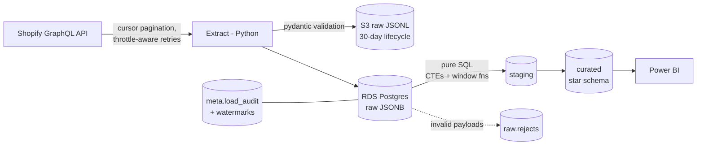

# E-commerce Data Warehouse MVP — Implementation Plan

> **For agentic workers:** REQUIRED SUB-SKILL: Use superpowers:subagent-driven-development (recommended) or superpowers:executing-plans to implement this plan task-by-task. Steps use checkbox (`- [ ]`) syntax for tracking.

**Goal:** A batch ELT pipeline that extracts orders/products/customers from the storeup.store Shopify GraphQL API, lands raw JSON in S3 (or a local dir) and Postgres (AWS RDS), transforms it with pure SQL into a star schema, and feeds a Power BI dashboard — idempotent, incremental, audited.

**Architecture:** Python extract layer (cursor pagination, throttle-aware retries) → pydantic validation (failures → `raw.rejects`) → idempotent JSONB upserts into `raw.*` → full-rebuild SQL transforms (`staging.*` → `curated.*` star schema with CTEs/window functions) → SQL data-quality gates → `meta.load_audit` + per-entity watermarks for incremental runs.

**Tech Stack:** Python 3.11+, requests, pydantic v2, psycopg 3, boto3, pytest, Docker (local Postgres 16), AWS (S3 + RDS Postgres free tier), Power BI Desktop.

**Spec:** `docs/superpowers/specs/2026-06-12-ecommerce-data-warehouse-design.md`

**Environment notes for the implementer:**
- Windows 10, PowerShell. Use `python -m pytest`, `docker compose`, backslash paths are fine.
- Repo root: `e:\dev\08-data\ecommerce-data-warehouse`. All paths below are relative to it.
- Shopify credentials exist in `f:\tmp\shopify.env` (app "storeia", store storeup.store). Never commit them.
- Tests that need Postgres use the Docker container from Task 1 (`DATABASE_URL=postgresql://dw:dw@localhost:5433/ecommerce_dw`). Start it once: `docker compose up -d`.

---

### Task 1: Project scaffolding

**Files:**
- Create: `.gitignore`, `requirements.txt`, `.env.example`, `docker-compose.yml`, `pytest.ini`
- Create: `extract/__init__.py`, `load/__init__.py`, `transform/__init__.py`, `tests/__init__.py` (all empty)

- [ ] **Step 1: Create `.gitignore`**

```gitignore
.env
.venv/
__pycache__/
*.pyc
.pytest_cache/
data/raw_local/
*.pbix
```

- [ ] **Step 2: Create `requirements.txt`**

```
requests>=2.31
pydantic>=2.5
psycopg[binary]>=3.1
boto3>=1.34
python-dotenv>=1.0
pytest>=8.0
```

- [ ] **Step 3: Create `.env.example`**

```ini
# Shopify Admin API (copy real values from f:\tmp\shopify.env — NEVER commit .env)
SHOPIFY_SHOP_DOMAIN=your-store.myshopify.com
SHOPIFY_ACCESS_TOKEN=shpat_xxx

# Postgres (local docker for dev; AWS RDS for prod runs)
DATABASE_URL=postgresql://dw:dw@localhost:5433/ecommerce_dw

# Raw layer destination: if S3_BUCKET is empty, raw files go to data/raw_local/
S3_BUCKET=
AWS_REGION=us-east-1
```

- [ ] **Step 4: Create `docker-compose.yml`**

```yaml
services:
  postgres:
    image: postgres:16
    environment:
      POSTGRES_USER: dw
      POSTGRES_PASSWORD: dw
      POSTGRES_DB: ecommerce_dw
    ports:
      - "5433:5432"
```

- [ ] **Step 5: Create `pytest.ini`**

```ini
[pytest]
testpaths = tests
```

- [ ] **Step 6: Create empty package files**

Create `extract/__init__.py`, `load/__init__.py`, `transform/__init__.py`, `tests/__init__.py` — all empty.

- [ ] **Step 7: Set up venv, install deps, start Postgres**

Run:
```powershell
python -m venv .venv
.venv\Scripts\Activate.ps1
pip install -r requirements.txt
docker compose up -d
```
Expected: deps install cleanly; `docker compose ps` shows postgres "running".

- [ ] **Step 8: Commit**

```bash
git add .gitignore requirements.txt .env.example docker-compose.yml pytest.ini extract load transform tests
git commit -m "chore: project scaffolding (deps, docker postgres, packages)"
```

---

### Task 2: Shopify GraphQL client (retries, throttle handling)

**Files:**
- Create: `extract/shopify_client.py`
- Test: `tests/test_shopify_client.py`

- [ ] **Step 1: Write the failing tests**

`tests/test_shopify_client.py`:

```python
import pytest
import requests
from extract.shopify_client import ShopifyClient, ShopifyError


class FakeResponse:
    def __init__(self, status_code=200, body=None):
        self.status_code = status_code
        self._body = body if body is not None else {}

    def json(self):
        return self._body

    def raise_for_status(self):
        if self.status_code >= 400:
            raise requests.HTTPError(f"HTTP {self.status_code}")


class FakeSession:
    def __init__(self, responses):
        self.responses = list(responses)
        self.calls = []

    def post(self, url, json=None, headers=None, timeout=None):
        self.calls.append({"url": url, "json": json, "headers": headers})
        return self.responses.pop(0)


def make_client(responses, max_retries=3):
    session = FakeSession(responses)
    client = ShopifyClient(
        shop_domain="test.myshopify.com",
        access_token="tok123",
        session=session,
        max_retries=max_retries,
        sleep=lambda s: None,
    )
    return client, session


def test_execute_returns_data_and_sends_auth_header():
    ok = FakeResponse(200, {"data": {"shop": {"name": "x"}}})
    client, session = make_client([ok])
    data = client.execute("query { shop { name } }")
    assert data == {"shop": {"name": "x"}}
    call = session.calls[0]
    assert call["headers"]["X-Shopify-Access-Token"] == "tok123"
    assert "2025-01/graphql.json" in call["url"]


def test_retries_on_429_then_succeeds():
    ok = FakeResponse(200, {"data": {"ok": True}})
    client, session = make_client([FakeResponse(429), ok])
    assert client.execute("q") == {"ok": True}
    assert len(session.calls) == 2


def test_retries_on_throttled_graphql_error():
    throttled = FakeResponse(200, {"errors": [{"message": "Throttled",
                                               "extensions": {"code": "THROTTLED"}}]})
    ok = FakeResponse(200, {"data": {"ok": True}})
    client, session = make_client([throttled, ok])
    assert client.execute("q") == {"ok": True}
    assert len(session.calls) == 2


def test_gives_up_after_max_retries():
    client, _ = make_client([FakeResponse(429)] * 4, max_retries=3)
    with pytest.raises(ShopifyError):
        client.execute("q")


def test_non_throttle_graphql_error_raises():
    bad = FakeResponse(200, {"errors": [{"message": "syntax error"}]})
    client, _ = make_client([bad])
    with pytest.raises(ShopifyError, match="syntax error"):
        client.execute("q")
```

- [ ] **Step 2: Run tests to verify they fail**

Run: `python -m pytest tests/test_shopify_client.py -v`
Expected: FAIL — `ModuleNotFoundError: No module named 'extract.shopify_client'`

- [ ] **Step 3: Implement `extract/shopify_client.py`**

```python
"""Shopify Admin GraphQL client with bounded retries and throttle handling."""
import random
import time

import requests

API_VERSION = "2025-01"
RETRYABLE_STATUS = {429, 500, 502, 503, 504}


class ShopifyError(Exception):
    pass


class ShopifyClient:
    def __init__(self, shop_domain, access_token, session=None,
                 max_retries=5, sleep=time.sleep):
        self.url = f"https://{shop_domain}/admin/api/{API_VERSION}/graphql.json"
        self.headers = {
            "X-Shopify-Access-Token": access_token,
            "Content-Type": "application/json",
        }
        self.session = session or requests.Session()
        self.max_retries = max_retries
        self.sleep = sleep

    def execute(self, query, variables=None):
        attempt = 0
        while True:
            resp = self.session.post(
                self.url,
                json={"query": query, "variables": variables or {}},
                headers=self.headers,
                timeout=30,
            )
            if resp.status_code in RETRYABLE_STATUS:
                attempt = self._backoff_or_raise(attempt, f"HTTP {resp.status_code}")
                continue
            resp.raise_for_status()
            body = resp.json()
            errors = body.get("errors")
            if errors:
                if any(e.get("extensions", {}).get("code") == "THROTTLED" for e in errors):
                    attempt = self._backoff_or_raise(attempt, "THROTTLED")
                    continue
                raise ShopifyError(f"GraphQL errors: {errors}")
            return body["data"]

    def _backoff_or_raise(self, attempt, reason):
        attempt += 1
        if attempt > self.max_retries:
            raise ShopifyError(f"Gave up after {self.max_retries} retries ({reason})")
        self.sleep(min(2 ** attempt + random.random(), 30))
        return attempt
```

- [ ] **Step 4: Run tests to verify they pass**

Run: `python -m pytest tests/test_shopify_client.py -v`
Expected: 5 PASSED

- [ ] **Step 5: Commit**

```bash
git add extract/shopify_client.py tests/test_shopify_client.py
git commit -m "feat: Shopify GraphQL client with retry/backoff and throttle handling"
```

---

### Task 3: GraphQL queries + paginated extractor

**Files:**
- Create: `extract/queries.py`, `extract/extractor.py`
- Test: `tests/test_extractor.py`

- [ ] **Step 1: Write the failing tests**

`tests/test_extractor.py`:

```python
from datetime import datetime, timezone

from extract.extractor import extract_entity


class FakeClient:
    """Scripted client: returns one response per execute() call, records variables."""

    def __init__(self, pages):
        self.pages = list(pages)
        self.calls = []

    def execute(self, query, variables=None):
        self.calls.append(variables)
        return self.pages.pop(0)


def page(root, nodes, has_next, cursor=None):
    return {root: {
        "edges": [{"node": n} for n in nodes],
        "pageInfo": {"hasNextPage": has_next, "endCursor": cursor},
    }}


def test_paginates_until_has_next_page_false():
    client = FakeClient([
        page("orders", [{"id": "gid://1"}, {"id": "gid://2"}], True, "c1"),
        page("orders", [{"id": "gid://3"}], False),
    ])
    records = list(extract_entity(client, "orders"))
    assert [r["id"] for r in records] == ["gid://1", "gid://2", "gid://3"]
    assert client.calls[0]["cursor"] is None
    assert client.calls[1]["cursor"] == "c1"


def test_incremental_passes_updated_at_filter():
    client = FakeClient([page("orders", [], False)])
    since = datetime(2026, 6, 1, tzinfo=timezone.utc)
    list(extract_entity(client, "orders", updated_since=since))
    assert client.calls[0]["query"] == "updated_at:>='2026-06-01T00:00:00+00:00'"


def test_full_extract_passes_null_filter():
    client = FakeClient([page("products", [], False)])
    list(extract_entity(client, "products"))
    assert client.calls[0]["query"] is None


def test_unknown_entity_raises():
    import pytest
    with pytest.raises(KeyError):
        list(extract_entity(FakeClient([]), "invoices"))
```

- [ ] **Step 2: Run tests to verify they fail**

Run: `python -m pytest tests/test_extractor.py -v`
Expected: FAIL — `ModuleNotFoundError: No module named 'extract.extractor'`

- [ ] **Step 3: Implement `extract/queries.py`**

```python
"""GraphQL documents. All use cursor pagination + optional updated_at search filter."""

ORDERS_QUERY = """
query Orders($cursor: String, $query: String) {
  orders(first: 50, after: $cursor, query: $query, sortKey: UPDATED_AT) {
    edges {
      node {
        id
        name
        createdAt
        processedAt
        updatedAt
        currencyCode
        totalPriceSet { shopMoney { amount } }
        subtotalPriceSet { shopMoney { amount } }
        customer { id }
        lineItems(first: 50) {
          edges {
            node {
              id
              title
              quantity
              sku
              product { id }
              originalUnitPriceSet { shopMoney { amount } }
            }
          }
        }
      }
    }
    pageInfo { hasNextPage endCursor }
  }
}
"""

PRODUCTS_QUERY = """
query Products($cursor: String, $query: String) {
  products(first: 50, after: $cursor, query: $query, sortKey: UPDATED_AT) {
    edges {
      node {
        id
        title
        status
        vendor
        productType
        createdAt
        updatedAt
        variants(first: 50) {
          edges { node { id sku price } }
        }
      }
    }
    pageInfo { hasNextPage endCursor }
  }
}
"""

CUSTOMERS_QUERY = """
query Customers($cursor: String, $query: String) {
  customers(first: 50, after: $cursor, query: $query, sortKey: UPDATED_AT) {
    edges {
      node {
        id
        displayName
        numberOfOrders
        createdAt
        updatedAt
      }
    }
    pageInfo { hasNextPage endCursor }
  }
}
"""

ENTITY_QUERIES = {
    "orders": (ORDERS_QUERY, "orders"),
    "products": (PRODUCTS_QUERY, "products"),
    "customers": (CUSTOMERS_QUERY, "customers"),
}
```

- [ ] **Step 4: Implement `extract/extractor.py`**

```python
"""Cursor-paginated extraction with optional updated_at watermark filter."""
from extract.queries import ENTITY_QUERIES


def extract_entity(client, entity, updated_since=None):
    query, root = ENTITY_QUERIES[entity]  # KeyError on unknown entity is intentional
    search = f"updated_at:>='{updated_since.isoformat()}'" if updated_since else None
    cursor = None
    while True:
        data = client.execute(query, {"cursor": cursor, "query": search})
        connection = data[root]
        for edge in connection["edges"]:
            yield edge["node"]
        page_info = connection["pageInfo"]
        if not page_info["hasNextPage"]:
            return
        cursor = page_info["endCursor"]
```

- [ ] **Step 5: Run tests to verify they pass**

Run: `python -m pytest tests/test_extractor.py -v`
Expected: 4 PASSED

- [ ] **Step 6: Commit**

```bash
git add extract/queries.py extract/extractor.py tests/test_extractor.py
git commit -m "feat: paginated entity extractor with incremental updated_at filter"
```

---

### Task 4: Payload validation (pydantic → rejects)

**Files:**
- Create: `load/models.py`
- Test: `tests/test_models.py`

- [ ] **Step 1: Write the failing tests**

`tests/test_models.py`:

```python
from load.models import validate_record


VALID_ORDER = {
    "id": "gid://shopify/Order/1",
    "name": "#1001",
    "createdAt": "2026-06-01T10:00:00Z",
    "processedAt": "2026-06-01T10:00:00Z",
    "updatedAt": "2026-06-01T10:00:00Z",
    "currencyCode": "EUR",
    "totalPriceSet": {"shopMoney": {"amount": "49.90"}},
    "subtotalPriceSet": {"shopMoney": {"amount": "41.24"}},
    "customer": {"id": "gid://shopify/Customer/7"},
    "lineItems": {"edges": []},
}


def test_valid_order_passes():
    ok, reason = validate_record("orders", VALID_ORDER)
    assert ok is True
    assert reason is None


def test_order_missing_total_is_rejected_with_reason():
    bad = {k: v for k, v in VALID_ORDER.items() if k != "totalPriceSet"}
    ok, reason = validate_record("orders", bad)
    assert ok is False
    assert "totalPriceSet" in reason


def test_order_with_null_customer_passes():
    guest = dict(VALID_ORDER, customer=None)
    ok, _ = validate_record("orders", guest)
    assert ok is True


def test_valid_product_passes():
    ok, _ = validate_record("products", {
        "id": "gid://shopify/Product/9",
        "title": "Mug",
        "status": "ACTIVE",
        "vendor": "storeup",
        "productType": "Kitchen",
        "createdAt": "2026-05-01T00:00:00Z",
        "updatedAt": "2026-05-01T00:00:00Z",
        "variants": {"edges": []},
    })
    assert ok is True


def test_valid_customer_passes():
    ok, _ = validate_record("customers", {
        "id": "gid://shopify/Customer/7",
        "displayName": "Test Buyer",
        "numberOfOrders": "3",
        "createdAt": "2026-05-01T00:00:00Z",
        "updatedAt": "2026-05-01T00:00:00Z",
    })
    assert ok is True


def test_garbage_is_rejected_not_raised():
    ok, reason = validate_record("orders", {"hello": "world"})
    assert ok is False
    assert reason
```

- [ ] **Step 2: Run tests to verify they fail**

Run: `python -m pytest tests/test_models.py -v`
Expected: FAIL — `ModuleNotFoundError: No module named 'load.models'`

- [ ] **Step 3: Implement `load/models.py`**

```python
"""Pydantic validation gates. Invalid payloads go to raw.rejects, never crash the run."""
from datetime import datetime
from typing import Optional

from pydantic import BaseModel, ConfigDict, ValidationError


class Money(BaseModel):
    amount: str


class MoneySet(BaseModel):
    shopMoney: Money


class Ref(BaseModel):
    id: str


class OrderRecord(BaseModel):
    model_config = ConfigDict(extra="allow")
    id: str
    name: str
    createdAt: datetime
    processedAt: datetime
    updatedAt: datetime
    currencyCode: str
    totalPriceSet: MoneySet
    subtotalPriceSet: MoneySet
    customer: Optional[Ref] = None


class ProductRecord(BaseModel):
    model_config = ConfigDict(extra="allow")
    id: str
    title: str
    status: str
    createdAt: datetime
    updatedAt: datetime


class CustomerRecord(BaseModel):
    model_config = ConfigDict(extra="allow")
    id: str
    displayName: str
    createdAt: datetime
    updatedAt: datetime


MODELS = {
    "orders": OrderRecord,
    "products": ProductRecord,
    "customers": CustomerRecord,
}


def validate_record(entity, record):
    """Returns (True, None) or (False, short_reason)."""
    try:
        MODELS[entity].model_validate(record)
        return True, None
    except ValidationError as exc:
        first = exc.errors()[0]
        loc = ".".join(str(p) for p in first["loc"])
        return False, f"{loc}: {first['msg']}"
```

- [ ] **Step 4: Run tests to verify they pass**

Run: `python -m pytest tests/test_models.py -v`
Expected: 6 PASSED

- [ ] **Step 5: Commit**

```bash
git add load/models.py tests/test_models.py
git commit -m "feat: pydantic payload validation with reject reasons"
```

---

### Task 5: Raw writers (local dir + S3)

**Files:**
- Create: `load/raw_writer.py`
- Test: `tests/test_raw_writer.py`

- [ ] **Step 1: Write the failing tests**

`tests/test_raw_writer.py`:

```python
import json

from load.raw_writer import LocalRawWriter, S3RawWriter, writer_from_env


def test_local_writer_writes_jsonl(tmp_path):
    w = LocalRawWriter(base_dir=tmp_path)
    uri = w.write("orders", [{"id": "1"}, {"id": "2"}], load_id=7)
    files = list(tmp_path.rglob("*.jsonl"))
    assert len(files) == 1
    lines = files[0].read_text(encoding="utf-8").strip().splitlines()
    assert json.loads(lines[0]) == {"id": "1"}
    assert "orders" in uri and "load_7" in uri


def test_local_writer_empty_records_writes_nothing(tmp_path):
    w = LocalRawWriter(base_dir=tmp_path)
    uri = w.write("orders", [], load_id=7)
    assert uri is None
    assert list(tmp_path.rglob("*")) == []


class FakeS3:
    def __init__(self):
        self.puts = []

    def put_object(self, Bucket, Key, Body):
        self.puts.append({"Bucket": Bucket, "Key": Key, "Body": Body})


def test_s3_writer_puts_jsonl_object():
    s3 = FakeS3()
    w = S3RawWriter(bucket="my-bucket", client=s3)
    uri = w.write("orders", [{"id": "1"}], load_id=3)
    put = s3.puts[0]
    assert put["Bucket"] == "my-bucket"
    assert put["Key"].startswith("raw/orders/")
    assert put["Key"].endswith("load_3.jsonl")
    assert json.loads(put["Body"].decode("utf-8").strip()) == {"id": "1"}
    assert uri == f"s3://my-bucket/{put['Key']}"


def test_writer_from_env_prefers_s3(monkeypatch, tmp_path):
    monkeypatch.setenv("S3_BUCKET", "")
    w = writer_from_env(local_base=tmp_path)
    assert isinstance(w, LocalRawWriter)
```

- [ ] **Step 2: Run tests to verify they fail**

Run: `python -m pytest tests/test_raw_writer.py -v`
Expected: FAIL — `ModuleNotFoundError: No module named 'load.raw_writer'`

- [ ] **Step 3: Implement `load/raw_writer.py`**

```python
"""Raw layer writers: JSONL to S3 (data-lake staging) or local dir fallback."""
import json
import os
from datetime import date
from pathlib import Path


def _jsonl(records):
    return "\n".join(json.dumps(r, ensure_ascii=False) for r in records) + "\n"


class LocalRawWriter:
    def __init__(self, base_dir="data/raw_local"):
        self.base_dir = Path(base_dir)

    def write(self, entity, records, load_id):
        if not records:
            return None
        target = self.base_dir / entity / date.today().isoformat()
        target.mkdir(parents=True, exist_ok=True)
        path = target / f"load_{load_id}.jsonl"
        path.write_text(_jsonl(records), encoding="utf-8")
        return str(path)


class S3RawWriter:
    def __init__(self, bucket, client=None):
        import boto3
        self.bucket = bucket
        self.client = client or boto3.client("s3")

    def write(self, entity, records, load_id):
        if not records:
            return None
        key = f"raw/{entity}/{date.today().isoformat()}/load_{load_id}.jsonl"
        self.client.put_object(
            Bucket=self.bucket, Key=key,
            Body=_jsonl(records).encode("utf-8"),
        )
        return f"s3://{self.bucket}/{key}"


def writer_from_env(local_base="data/raw_local"):
    bucket = os.environ.get("S3_BUCKET", "").strip()
    if bucket:
        return S3RawWriter(bucket=bucket)
    return LocalRawWriter(base_dir=local_base)
```

- [ ] **Step 4: Run tests to verify they pass**

Run: `python -m pytest tests/test_raw_writer.py -v`
Expected: 4 PASSED

- [ ] **Step 5: Commit**

```bash
git add load/raw_writer.py tests/test_raw_writer.py
git commit -m "feat: raw JSONL writers (S3 + local fallback)"
```

---

### Task 6: Database bootstrap SQL + SQL runner

**Files:**
- Create: `transform/sql/001_schemas.sql`, `transform/runner.py`
- Test: `tests/conftest.py`, `tests/test_runner.py`

Postgres must be running (`docker compose up -d`).

- [ ] **Step 1: Write `tests/conftest.py` (shared db fixture)**

```python
import os

import psycopg
import pytest

DATABASE_URL = os.environ.get(
    "DATABASE_URL", "postgresql://dw:dw@localhost:5433/ecommerce_dw"
)


@pytest.fixture()
def db():
    """Fresh connection; drops all pipeline schemas so each test starts clean."""
    conn = psycopg.connect(DATABASE_URL, autocommit=True)
    for schema in ("raw", "staging", "curated", "meta"):
        conn.execute(f"drop schema if exists {schema} cascade")
    yield conn
    conn.close()
```

- [ ] **Step 2: Write the failing test**

`tests/test_runner.py`:

```python
from transform.runner import run_sql_file


def test_bootstrap_creates_schemas_and_tables(db):
    run_sql_file(db, "transform/sql/001_schemas.sql")
    tables = {
        (r[0], r[1])
        for r in db.execute(
            "select table_schema, table_name from information_schema.tables "
            "where table_schema in ('raw','meta')"
        ).fetchall()
    }
    assert ("raw", "orders") in tables
    assert ("raw", "products") in tables
    assert ("raw", "customers") in tables
    assert ("raw", "rejects") in tables
    assert ("meta", "load_audit") in tables
    assert ("meta", "watermarks") in tables


def test_bootstrap_is_idempotent(db):
    run_sql_file(db, "transform/sql/001_schemas.sql")
    run_sql_file(db, "transform/sql/001_schemas.sql")  # must not raise
```

- [ ] **Step 3: Run test to verify it fails**

Run: `python -m pytest tests/test_runner.py -v`
Expected: FAIL — `ModuleNotFoundError: No module named 'transform.runner'`

- [ ] **Step 4: Implement `transform/sql/001_schemas.sql`**

Constraint for all SQL files in this repo: one statement per `;`, **no semicolons inside string literals** (the runner splits on `;`).

```sql
create schema if not exists raw;
create schema if not exists staging;
create schema if not exists curated;
create schema if not exists meta;

create table if not exists raw.orders (
    shopify_gid  text primary key,
    payload      jsonb not null,
    load_id      bigint not null,
    extracted_at timestamptz not null,
    loaded_at    timestamptz not null default now()
);

create table if not exists raw.products (
    shopify_gid  text primary key,
    payload      jsonb not null,
    load_id      bigint not null,
    extracted_at timestamptz not null,
    loaded_at    timestamptz not null default now()
);

create table if not exists raw.customers (
    shopify_gid  text primary key,
    payload      jsonb not null,
    load_id      bigint not null,
    extracted_at timestamptz not null,
    loaded_at    timestamptz not null default now()
);

create table if not exists raw.rejects (
    reject_id   bigint generated always as identity primary key,
    entity      text not null,
    payload     jsonb not null,
    reason      text not null,
    load_id     bigint not null,
    rejected_at timestamptz not null default now()
);

create table if not exists meta.load_audit (
    load_id       bigint generated always as identity primary key,
    started_at    timestamptz not null default now(),
    finished_at   timestamptz,
    status        text not null default 'RUNNING',
    rows_extracted int not null default 0,
    rows_loaded    int not null default 0,
    rows_rejected  int not null default 0,
    error         text
);

create table if not exists meta.watermarks (
    entity          text primary key,
    last_updated_at timestamptz not null
);
```

- [ ] **Step 5: Implement `transform/runner.py`**

```python
"""Executes .sql files statement by statement (split on ';').

Convention: SQL files in transform/sql/ contain one statement per ';' and
no semicolons inside string literals.
"""
from pathlib import Path


def run_sql_file(conn, path):
    text = Path(path).read_text(encoding="utf-8")
    for statement in text.split(";"):
        statement = statement.strip()
        if statement:
            conn.execute(statement)


def run_sql_files(conn, paths):
    for path in paths:
        run_sql_file(conn, path)
```

- [ ] **Step 6: Run tests to verify they pass**

Run: `python -m pytest tests/test_runner.py -v`
Expected: 2 PASSED

- [ ] **Step 7: Commit**

```bash
git add transform/sql/001_schemas.sql transform/runner.py tests/conftest.py tests/test_runner.py
git commit -m "feat: db bootstrap SQL (raw/meta layers) + sql file runner"
```

---

### Task 7: Postgres loader (audit, idempotent upserts, rejects, watermarks)

**Files:**
- Create: `load/pg_loader.py`
- Test: `tests/test_pg_loader.py`

- [ ] **Step 1: Write the failing tests**

`tests/test_pg_loader.py`:

```python
from datetime import datetime, timezone

from load import pg_loader
from transform.runner import run_sql_file

NOW = datetime(2026, 6, 12, 12, 0, tzinfo=timezone.utc)


def bootstrap(db):
    run_sql_file(db, "transform/sql/001_schemas.sql")


def test_start_and_finish_load(db):
    bootstrap(db)
    load_id = pg_loader.start_load(db)
    assert load_id >= 1
    pg_loader.finish_load(db, load_id, status="SUCCESS",
                          rows_extracted=10, rows_loaded=9, rows_rejected=1)
    row = db.execute(
        "select status, rows_loaded, finished_at from meta.load_audit where load_id=%s",
        (load_id,),
    ).fetchone()
    assert row[0] == "SUCCESS"
    assert row[1] == 9
    assert row[2] is not None


def test_upsert_is_idempotent(db):
    bootstrap(db)
    records = [
        {"id": "gid://shopify/Order/1", "name": "#1001"},
        {"id": "gid://shopify/Order/2", "name": "#1002"},
    ]
    pg_loader.upsert_raw(db, "orders", records, load_id=1, extracted_at=NOW)
    pg_loader.upsert_raw(db, "orders", records, load_id=2, extracted_at=NOW)
    count = db.execute("select count(*) from raw.orders").fetchone()[0]
    assert count == 2
    load_id = db.execute(
        "select load_id from raw.orders where shopify_gid='gid://shopify/Order/1'"
    ).fetchone()[0]
    assert load_id == 2  # last write wins


def test_insert_reject(db):
    bootstrap(db)
    pg_loader.insert_reject(db, "orders", {"bad": True}, "totalPriceSet: missing", load_id=1)
    row = db.execute("select entity, reason from raw.rejects").fetchone()
    assert row == ("orders", "totalPriceSet: missing")


def test_watermark_roundtrip(db):
    bootstrap(db)
    assert pg_loader.get_watermark(db, "orders") is None
    pg_loader.set_watermark(db, "orders", NOW)
    assert pg_loader.get_watermark(db, "orders") == NOW
    later = datetime(2026, 6, 13, tzinfo=timezone.utc)
    pg_loader.set_watermark(db, "orders", later)
    assert pg_loader.get_watermark(db, "orders") == later
```

- [ ] **Step 2: Run tests to verify they fail**

Run: `python -m pytest tests/test_pg_loader.py -v`
Expected: FAIL — `ModuleNotFoundError` / missing functions

- [ ] **Step 3: Implement `load/pg_loader.py`**

```python
"""Postgres raw-layer loader: audit rows, idempotent upserts, rejects, watermarks."""
import json
import os

import psycopg


def connect():
    return psycopg.connect(os.environ["DATABASE_URL"], autocommit=True)


def start_load(conn):
    row = conn.execute(
        "insert into meta.load_audit default values returning load_id"
    ).fetchone()
    return row[0]


def finish_load(conn, load_id, status, rows_extracted=0, rows_loaded=0,
                rows_rejected=0, error=None):
    conn.execute(
        """
        update meta.load_audit
        set finished_at = now(), status = %s, rows_extracted = %s,
            rows_loaded = %s, rows_rejected = %s, error = %s
        where load_id = %s
        """,
        (status, rows_extracted, rows_loaded, rows_rejected, error, load_id),
    )


def upsert_raw(conn, entity, records, load_id, extracted_at):
    assert entity in ("orders", "products", "customers")
    sql = f"""
        insert into raw.{entity} (shopify_gid, payload, load_id, extracted_at)
        values (%s, %s, %s, %s)
        on conflict (shopify_gid) do update
        set payload = excluded.payload,
            load_id = excluded.load_id,
            extracted_at = excluded.extracted_at,
            loaded_at = now()
    """
    with conn.cursor() as cur:
        cur.executemany(
            sql,
            [(r["id"], json.dumps(r), load_id, extracted_at) for r in records],
        )


def insert_reject(conn, entity, payload, reason, load_id):
    conn.execute(
        "insert into raw.rejects (entity, payload, reason, load_id) values (%s, %s, %s, %s)",
        (entity, json.dumps(payload), reason, load_id),
    )


def get_watermark(conn, entity):
    row = conn.execute(
        "select last_updated_at from meta.watermarks where entity = %s", (entity,)
    ).fetchone()
    return row[0] if row else None


def set_watermark(conn, entity, ts):
    conn.execute(
        """
        insert into meta.watermarks (entity, last_updated_at) values (%s, %s)
        on conflict (entity) do update set last_updated_at = excluded.last_updated_at
        """,
        (entity, ts),
    )
```

- [ ] **Step 4: Run tests to verify they pass**

Run: `python -m pytest tests/test_pg_loader.py -v`
Expected: 4 PASSED

- [ ] **Step 5: Commit**

```bash
git add load/pg_loader.py tests/test_pg_loader.py
git commit -m "feat: pg loader with load audit, idempotent upserts, rejects, watermarks"
```

---

### Task 8: Staging transforms (SQL)

**Files:**
- Create: `transform/sql/010_staging.sql`
- Test: `tests/fixtures.py`, `tests/test_staging.py`

- [ ] **Step 1: Write shared fixtures**

`tests/fixtures.py`:

```python
"""Realistic raw payload fixtures shared by transform tests."""
from datetime import datetime, timezone

from load import pg_loader

NOW = datetime(2026, 6, 12, 12, 0, tzinfo=timezone.utc)


def order(n, customer_gid, total, items, processed="2026-06-01T10:00:00Z"):
    return {
        "id": f"gid://shopify/Order/{n}",
        "name": f"#10{n:02d}",
        "createdAt": processed,
        "processedAt": processed,
        "updatedAt": processed,
        "currencyCode": "EUR",
        "totalPriceSet": {"shopMoney": {"amount": str(total)}},
        "subtotalPriceSet": {"shopMoney": {"amount": str(total)}},
        "customer": {"id": customer_gid} if customer_gid else None,
        "lineItems": {"edges": [{"node": i} for i in items]},
    }


def item(n, product_gid, qty, unit_price):
    return {
        "id": f"gid://shopify/LineItem/{n}",
        "title": f"Item {n}",
        "quantity": qty,
        "sku": f"SKU-{n}",
        "product": {"id": product_gid},
        "originalUnitPriceSet": {"shopMoney": {"amount": str(unit_price)}},
    }


def product(n, title="Mug"):
    return {
        "id": f"gid://shopify/Product/{n}",
        "title": title,
        "status": "ACTIVE",
        "vendor": "storeup",
        "productType": "Kitchen",
        "createdAt": "2026-05-01T00:00:00Z",
        "updatedAt": "2026-05-01T00:00:00Z",
        "variants": {"edges": []},
    }


def customer(n, name="Test Buyer"):
    return {
        "id": f"gid://shopify/Customer/{n}",
        "displayName": name,
        "numberOfOrders": "1",
        "createdAt": "2026-05-01T00:00:00Z",
        "updatedAt": "2026-05-01T00:00:00Z",
    }


def seed_raw(db):
    """Two products, two customers, three orders (one is a guest order)."""
    pg_loader.upsert_raw(db, "products", [product(1, "Mug"), product(2, "Tee")],
                         load_id=1, extracted_at=NOW)
    pg_loader.upsert_raw(db, "customers", [customer(1, "Ana"), customer(2, "Luis")],
                         load_id=1, extracted_at=NOW)
    pg_loader.upsert_raw(db, "orders", [
        order(1, "gid://shopify/Customer/1", "30.00",
              [item(1, "gid://shopify/Product/1", 2, "15.00")],
              processed="2026-06-01T10:00:00Z"),
        order(2, "gid://shopify/Customer/1", "20.00",
              [item(2, "gid://shopify/Product/2", 1, "20.00")],
              processed="2026-06-05T10:00:00Z"),
        order(3, None, "15.00",
              [item(3, "gid://shopify/Product/1", 1, "15.00")],
              processed="2026-06-08T10:00:00Z"),
    ], load_id=1, extracted_at=NOW)
```

- [ ] **Step 2: Write the failing tests**

`tests/test_staging.py`:

```python
from decimal import Decimal

from tests.fixtures import seed_raw
from transform.runner import run_sql_files

SQL = ["transform/sql/001_schemas.sql", "transform/sql/010_staging.sql"]


def test_staging_orders_typed_and_complete(db):
    run_sql_files(db, SQL[:1])
    seed_raw(db)
    run_sql_files(db, SQL[1:])
    rows = db.execute(
        "select order_gid, total_amount, customer_gid from staging.orders order by order_gid"
    ).fetchall()
    assert len(rows) == 3
    assert rows[0][1] == Decimal("30.00")
    guest = db.execute(
        "select customer_gid from staging.orders where order_gid='gid://shopify/Order/3'"
    ).fetchone()
    assert guest[0] is None


def test_staging_order_items_flattened(db):
    run_sql_files(db, SQL[:1])
    seed_raw(db)
    run_sql_files(db, SQL[1:])
    count = db.execute("select count(*) from staging.order_items").fetchone()[0]
    assert count == 3
    row = db.execute(
        "select quantity, unit_price from staging.order_items "
        "where line_item_gid='gid://shopify/LineItem/1'"
    ).fetchone()
    assert row == (2, Decimal("15.00"))


def test_staging_rebuild_is_repeatable(db):
    run_sql_files(db, SQL[:1])
    seed_raw(db)
    run_sql_files(db, SQL[1:])
    run_sql_files(db, SQL[1:])  # full rebuild must not raise or duplicate
    assert db.execute("select count(*) from staging.orders").fetchone()[0] == 3
```

- [ ] **Step 3: Run tests to verify they fail**

Run: `python -m pytest tests/test_staging.py -v`
Expected: FAIL — file `transform/sql/010_staging.sql` not found

- [ ] **Step 4: Implement `transform/sql/010_staging.sql`**

```sql
drop table if exists staging.order_items cascade;
drop table if exists staging.orders cascade;
drop table if exists staging.products cascade;
drop table if exists staging.customers cascade;

create table staging.orders as
select
    payload->>'id'                                          as order_gid,
    payload->>'name'                                        as order_name,
    (payload->>'createdAt')::timestamptz                    as created_at,
    (payload->>'processedAt')::timestamptz                  as processed_at,
    (payload->>'updatedAt')::timestamptz                    as updated_at,
    payload->>'currencyCode'                                as currency,
    (payload#>>'{totalPriceSet,shopMoney,amount}')::numeric(12,2)    as total_amount,
    (payload#>>'{subtotalPriceSet,shopMoney,amount}')::numeric(12,2) as subtotal_amount,
    payload#>>'{customer,id}'                               as customer_gid
from raw.orders;

alter table staging.orders add primary key (order_gid);

create table staging.order_items as
select
    o.payload->>'id'                                        as order_gid,
    e.edge#>>'{node,id}'                                    as line_item_gid,
    e.edge#>>'{node,title}'                                 as title,
    (e.edge#>>'{node,quantity}')::int                       as quantity,
    e.edge#>>'{node,sku}'                                   as sku,
    e.edge#>>'{node,product,id}'                            as product_gid,
    (e.edge#>>'{node,originalUnitPriceSet,shopMoney,amount}')::numeric(12,2) as unit_price
from raw.orders o
cross join lateral jsonb_array_elements(o.payload#>'{lineItems,edges}') as e(edge);

alter table staging.order_items add primary key (line_item_gid);

create table staging.products as
select
    payload->>'id'                       as product_gid,
    payload->>'title'                    as title,
    payload->>'status'                   as status,
    payload->>'vendor'                   as vendor,
    payload->>'productType'              as product_type,
    (payload->>'createdAt')::timestamptz as created_at,
    (payload->>'updatedAt')::timestamptz as updated_at
from raw.products;

alter table staging.products add primary key (product_gid);

create table staging.customers as
select
    payload->>'id'                        as customer_gid,
    payload->>'displayName'               as display_name,
    (payload->>'numberOfOrders')::int     as orders_count,
    (payload->>'createdAt')::timestamptz  as created_at,
    (payload->>'updatedAt')::timestamptz  as updated_at
from raw.customers;

alter table staging.customers add primary key (customer_gid);
```

- [ ] **Step 5: Run tests to verify they pass**

Run: `python -m pytest tests/test_staging.py -v`
Expected: 3 PASSED

- [ ] **Step 6: Commit**

```bash
git add transform/sql/010_staging.sql tests/fixtures.py tests/test_staging.py
git commit -m "feat: staging layer SQL (typed, flattened, rebuildable)"
```

---

### Task 9: Curated star schema (SQL with window functions)

**Files:**
- Create: `transform/sql/020_curated.sql`
- Test: `tests/test_curated.py`

- [ ] **Step 1: Write the failing tests**

`tests/test_curated.py`:

```python
from decimal import Decimal

from tests.fixtures import seed_raw
from transform.runner import run_sql_files

ALL_SQL = [
    "transform/sql/001_schemas.sql",
    "transform/sql/010_staging.sql",
    "transform/sql/020_curated.sql",
]


def build(db):
    run_sql_files(db, ALL_SQL[:1])
    seed_raw(db)
    run_sql_files(db, ALL_SQL[1:])


def test_star_schema_tables_exist_with_rows(db):
    build(db)
    for table, expected in [
        ("curated.dim_product", 2),
        ("curated.dim_customer", 2),
        ("curated.fact_orders", 3),
        ("curated.fact_order_items", 3),
    ]:
        assert db.execute(f"select count(*) from {table}").fetchone()[0] == expected


def test_dim_date_covers_order_range(db):
    build(db)
    row = db.execute("select min(date_key), max(date_key) from curated.dim_date").fetchone()
    assert str(row[0]) <= "2026-06-01"


def test_fact_orders_customer_sequence_window(db):
    build(db)
    # Ana has 2 orders -> sequence 1 then 2 (row_number window function)
    rows = db.execute(
        """
        select f.order_gid, f.customer_order_seq
        from curated.fact_orders f
        join curated.dim_customer c on c.customer_key = f.customer_key
        where c.display_name = 'Ana'
        order by f.customer_order_seq
        """
    ).fetchall()
    assert [r[1] for r in rows] == [1, 2]


def test_guest_order_has_null_customer_key(db):
    build(db)
    row = db.execute(
        "select customer_key from curated.fact_orders where order_gid='gid://shopify/Order/3'"
    ).fetchone()
    assert row[0] is None


def test_fact_items_revenue_matches_orders(db):
    build(db)
    items_total = db.execute(
        "select sum(quantity * unit_price) from curated.fact_order_items"
    ).fetchone()[0]
    orders_total = db.execute(
        "select sum(total_amount) from curated.fact_orders"
    ).fetchone()[0]
    assert items_total == orders_total == Decimal("65.00")
```

- [ ] **Step 2: Run tests to verify they fail**

Run: `python -m pytest tests/test_curated.py -v`
Expected: FAIL — file `transform/sql/020_curated.sql` not found

- [ ] **Step 3: Implement `transform/sql/020_curated.sql`**

```sql
drop table if exists curated.fact_order_items cascade;
drop table if exists curated.fact_orders cascade;
drop table if exists curated.dim_product cascade;
drop table if exists curated.dim_customer cascade;
drop table if exists curated.dim_date cascade;

create table curated.dim_date as
select
    d::date                       as date_key,
    extract(year from d)::int     as year,
    extract(month from d)::int    as month,
    to_char(d, 'YYYY-MM')         as year_month,
    extract(isodow from d)::int   as day_of_week,
    to_char(d, 'Dy')              as day_name
from generate_series(
    (select coalesce(min(processed_at)::date, current_date) - 7 from staging.orders),
    current_date + 30,
    interval '1 day'
) as d;

alter table curated.dim_date add primary key (date_key);

create table curated.dim_product as
select
    row_number() over (order by product_gid) as product_key,
    product_gid,
    title,
    vendor,
    product_type,
    status
from staging.products;

alter table curated.dim_product add primary key (product_key);
create unique index dim_product_gid_uq on curated.dim_product (product_gid);

create table curated.dim_customer as
select
    row_number() over (order by customer_gid) as customer_key,
    customer_gid,
    display_name,
    orders_count,
    created_at
from staging.customers;

alter table curated.dim_customer add primary key (customer_key);
create unique index dim_customer_gid_uq on curated.dim_customer (customer_gid);

create table curated.fact_orders as
with orders as (
    select
        o.order_gid,
        o.order_name,
        o.processed_at,
        o.processed_at::date as date_key,
        c.customer_key,
        o.customer_gid,
        o.currency,
        o.subtotal_amount,
        o.total_amount
    from staging.orders o
    left join curated.dim_customer c using (customer_gid)
)
select
    order_gid,
    order_name,
    processed_at,
    date_key,
    customer_key,
    currency,
    subtotal_amount,
    total_amount,
    row_number() over (partition by customer_gid order by processed_at) as customer_order_seq,
    sum(total_amount) over (order by processed_at
                            rows between unbounded preceding and current row) as running_revenue
from orders;

alter table curated.fact_orders add primary key (order_gid);
alter table curated.fact_orders add foreign key (date_key) references curated.dim_date (date_key);
alter table curated.fact_orders add foreign key (customer_key) references curated.dim_customer (customer_key);

create table curated.fact_order_items as
select
    i.line_item_gid,
    i.order_gid,
    p.product_key,
    i.title,
    i.sku,
    i.quantity,
    i.unit_price,
    (i.quantity * i.unit_price)::numeric(12,2) as line_revenue
from staging.order_items i
left join curated.dim_product p using (product_gid);

alter table curated.fact_order_items add primary key (line_item_gid);
alter table curated.fact_order_items add foreign key (order_gid) references curated.fact_orders (order_gid);
alter table curated.fact_order_items add foreign key (product_key) references curated.dim_product (product_key);
```

- [ ] **Step 4: Run tests to verify they pass**

Run: `python -m pytest tests/test_curated.py -v`
Expected: 5 PASSED

- [ ] **Step 5: Commit**

```bash
git add transform/sql/020_curated.sql tests/test_curated.py
git commit -m "feat: curated star schema with window functions (dims, facts, dim_date)"
```

---

### Task 10: Data quality gates

**Files:**
- Create: `transform/quality.py`
- Test: `tests/test_quality.py`

- [ ] **Step 1: Write the failing tests**

`tests/test_quality.py`:

```python
import pytest

from tests.fixtures import seed_raw
from transform.quality import QualityError, run_quality_checks
from transform.runner import run_sql_files

ALL_SQL = [
    "transform/sql/001_schemas.sql",
    "transform/sql/010_staging.sql",
    "transform/sql/020_curated.sql",
]


def build(db):
    run_sql_files(db, ALL_SQL[:1])
    seed_raw(db)
    run_sql_files(db, ALL_SQL[1:])


def test_clean_build_passes_all_checks(db):
    build(db)
    results = run_quality_checks(db)
    assert all(violations == 0 for _, violations in results)


def test_broken_reconciliation_raises(db):
    build(db)
    db.execute("delete from curated.fact_orders where order_gid='gid://shopify/Order/3'")
    with pytest.raises(QualityError, match="fact_orders_matches_staging"):
        run_quality_checks(db)
```

- [ ] **Step 2: Run tests to verify they fail**

Run: `python -m pytest tests/test_quality.py -v`
Expected: FAIL — `ModuleNotFoundError: No module named 'transform.quality'`

- [ ] **Step 3: Implement `transform/quality.py`**

```python
"""Post-transform data quality gates. Any violation fails the pipeline run."""


class QualityError(Exception):
    pass


CHECKS = [
    ("fact_orders_matches_staging",
     """
     select abs((select count(*) from curated.fact_orders)
              - (select count(*) from staging.orders))
     """),
    ("no_orphan_order_items",
     """
     select count(*) from curated.fact_order_items i
     left join curated.fact_orders o using (order_gid)
     where o.order_gid is null
     """),
    ("no_duplicate_product_gids",
     """
     select count(*) from (
       select product_gid from curated.dim_product
       group by product_gid having count(*) > 1
     ) d
     """),
    ("no_duplicate_customer_gids",
     """
     select count(*) from (
       select customer_gid from curated.dim_customer
       group by customer_gid having count(*) > 1
     ) d
     """),
    ("item_revenue_reconciles_with_orders",
     """
     select count(*) from (
       select 1
       where abs(coalesce((select sum(line_revenue) from curated.fact_order_items), 0)
               - coalesce((select sum(total_amount) from curated.fact_orders), 0)) > 0.01
     ) d
     """),
]


def run_quality_checks(conn):
    """Returns [(name, violations)]. Raises QualityError on the first failure."""
    results = []
    for name, sql in CHECKS:
        violations = conn.execute(sql).fetchone()[0]
        results.append((name, violations))
        if violations != 0:
            raise QualityError(f"quality check failed: {name} ({violations} violations)")
    return results
```

Note: `item_revenue_reconciles_with_orders` assumes test orders have no shipping/discounts (seeded data is built that way). Real stores would compare against `subtotal`; documented in README later.

- [ ] **Step 4: Run tests to verify they pass**

Run: `python -m pytest tests/test_quality.py -v`
Expected: 2 PASSED

- [ ] **Step 5: Commit**

```bash
git add transform/quality.py tests/test_quality.py
git commit -m "feat: SQL data-quality gates (reconciliation, orphans, duplicates)"
```

---

### Task 11: Pipeline orchestrator + CLI

**Files:**
- Create: `pipeline.py`
- Test: `tests/test_pipeline.py`

- [ ] **Step 1: Write the failing tests**

`tests/test_pipeline.py`:

```python
from datetime import datetime, timezone

from load.raw_writer import LocalRawWriter
from pipeline import run_pipeline
from tests import fixtures


def fake_extract_factory(data):
    """data: {entity: [records]} — mimics extract_entity(client, entity, updated_since)."""
    calls = []

    def fake_extract(client, entity, updated_since=None):
        calls.append((entity, updated_since))
        yield from data.get(entity, [])

    fake_extract.calls = calls
    return fake_extract


def seed_data():
    return {
        "products": [fixtures.product(1, "Mug"), fixtures.product(2, "Tee")],
        "customers": [fixtures.customer(1, "Ana"), fixtures.customer(2, "Luis")],
        "orders": [
            fixtures.order(1, "gid://shopify/Customer/1", "30.00",
                           [fixtures.item(1, "gid://shopify/Product/1", 2, "15.00")]),
        ],
    }


def test_pipeline_end_to_end(db, tmp_path):
    extract = fake_extract_factory(seed_data())
    result = run_pipeline(conn=db, client=None, extract_fn=extract,
                          writer=LocalRawWriter(tmp_path))
    assert result["status"] == "SUCCESS"
    assert db.execute("select count(*) from curated.fact_orders").fetchone()[0] == 1
    status = db.execute(
        "select status from meta.load_audit where load_id=%s", (result["load_id"],)
    ).fetchone()[0]
    assert status == "SUCCESS"
    # watermarks advanced
    wm = db.execute("select count(*) from meta.watermarks").fetchone()[0]
    assert wm == 3


def test_pipeline_routes_invalid_records_to_rejects(db, tmp_path):
    data = seed_data()
    data["orders"].append({"id": "gid://shopify/Order/99"})  # invalid: missing fields
    extract = fake_extract_factory(data)
    result = run_pipeline(conn=db, client=None, extract_fn=extract,
                          writer=LocalRawWriter(tmp_path))
    assert result["status"] == "SUCCESS"
    assert result["rows_rejected"] == 1
    reason = db.execute("select reason from raw.rejects").fetchone()[0]
    assert reason


def test_second_run_uses_watermarks(db, tmp_path):
    extract = fake_extract_factory(seed_data())
    run_pipeline(conn=db, client=None, extract_fn=extract, writer=LocalRawWriter(tmp_path))
    extract2 = fake_extract_factory(seed_data())
    run_pipeline(conn=db, client=None, extract_fn=extract2, writer=LocalRawWriter(tmp_path))
    assert all(since is not None for _, since in extract2.calls)


def test_full_flag_ignores_watermarks(db, tmp_path):
    extract = fake_extract_factory(seed_data())
    run_pipeline(conn=db, client=None, extract_fn=extract, writer=LocalRawWriter(tmp_path))
    extract2 = fake_extract_factory(seed_data())
    run_pipeline(conn=db, client=None, extract_fn=extract2,
                 writer=LocalRawWriter(tmp_path), full=True)
    assert all(since is None for _, since in extract2.calls)


def test_failure_marks_audit_failed_and_keeps_watermarks(db, tmp_path):
    extract = fake_extract_factory(seed_data())
    run_pipeline(conn=db, client=None, extract_fn=extract, writer=LocalRawWriter(tmp_path))
    wm_before = db.execute(
        "select last_updated_at from meta.watermarks where entity='orders'"
    ).fetchone()[0]

    def exploding_extract(client, entity, updated_since=None):
        raise RuntimeError("boom")
        yield  # pragma: no cover

    import pytest
    with pytest.raises(RuntimeError):
        run_pipeline(conn=db, client=None, extract_fn=exploding_extract,
                     writer=LocalRawWriter(tmp_path))
    last_status = db.execute(
        "select status from meta.load_audit order by load_id desc limit 1"
    ).fetchone()[0]
    assert last_status == "FAILED"
    wm_after = db.execute(
        "select last_updated_at from meta.watermarks where entity='orders'"
    ).fetchone()[0]
    assert wm_after == wm_before
```

- [ ] **Step 2: Run tests to verify they fail**

Run: `python -m pytest tests/test_pipeline.py -v`
Expected: FAIL — `ModuleNotFoundError: No module named 'pipeline'`

- [ ] **Step 3: Implement `pipeline.py`**

```python
"""Batch ELT orchestrator: extract -> validate -> raw (S3 + Postgres) -> SQL transforms -> quality gates.

Usage:
    python pipeline.py            # incremental (per-entity updated_at watermarks)
    python pipeline.py --full     # ignore watermarks, full re-extract
"""
import argparse
import logging
import os
import sys
from datetime import datetime, timezone

from dotenv import load_dotenv

from extract.extractor import extract_entity
from extract.shopify_client import ShopifyClient
from load import pg_loader
from load.models import validate_record
from load.raw_writer import writer_from_env
from transform.quality import run_quality_checks
from transform.runner import run_sql_files

logging.basicConfig(level=logging.INFO, format="%(asctime)s %(levelname)s %(message)s")
log = logging.getLogger("pipeline")

ENTITIES = ["products", "customers", "orders"]  # dims before facts
TRANSFORM_SQL = ["transform/sql/010_staging.sql", "transform/sql/020_curated.sql"]


def _parse_ts(value):
    return datetime.fromisoformat(value.replace("Z", "+00:00"))


def run_pipeline(conn, client, extract_fn=extract_entity, writer=None, full=False):
    writer = writer or writer_from_env()
    run_sql_files(conn, ["transform/sql/001_schemas.sql"])
    load_id = pg_loader.start_load(conn)
    extracted = loaded = rejected = 0
    new_watermarks = {}
    try:
        for entity in ENTITIES:
            since = None if full else pg_loader.get_watermark(conn, entity)
            good, max_updated = [], None
            for record in extract_fn(client, entity, updated_since=since):
                extracted += 1
                ok, reason = validate_record(entity, record)
                if not ok:
                    rejected += 1
                    pg_loader.insert_reject(conn, entity, record, reason, load_id)
                    continue
                good.append(record)
                ts = _parse_ts(record["updatedAt"])
                if max_updated is None or ts > max_updated:
                    max_updated = ts
            uri = writer.write(entity, good, load_id)
            pg_loader.upsert_raw(conn, entity, good, load_id,
                                 extracted_at=datetime.now(timezone.utc))
            loaded += len(good)
            if max_updated:
                new_watermarks[entity] = max_updated
            log.info("%s: extracted=%d loaded=%d raw_file=%s",
                     entity, len(good), len(good), uri)

        run_sql_files(conn, TRANSFORM_SQL)
        run_quality_checks(conn)

        for entity, ts in new_watermarks.items():
            pg_loader.set_watermark(conn, entity, ts)
        pg_loader.finish_load(conn, load_id, "SUCCESS", extracted, loaded, rejected)
        log.info("load %d SUCCESS (extracted=%d loaded=%d rejected=%d)",
                 load_id, extracted, loaded, rejected)
        return {"status": "SUCCESS", "load_id": load_id,
                "rows_extracted": extracted, "rows_loaded": loaded,
                "rows_rejected": rejected}
    except Exception as exc:
        pg_loader.finish_load(conn, load_id, "FAILED", extracted, loaded,
                              rejected, error=str(exc))
        log.error("load %d FAILED: %s", load_id, exc)
        raise


def main():
    parser = argparse.ArgumentParser()
    parser.add_argument("--full", action="store_true", help="ignore watermarks")
    args = parser.parse_args()
    load_dotenv()
    client = ShopifyClient(
        shop_domain=os.environ["SHOPIFY_SHOP_DOMAIN"],
        access_token=os.environ["SHOPIFY_ACCESS_TOKEN"],
    )
    conn = pg_loader.connect()
    try:
        run_pipeline(conn, client, full=args.full)
    finally:
        conn.close()


if __name__ == "__main__":
    sys.exit(main())
```

- [ ] **Step 4: Run all tests**

Run: `python -m pytest -v`
Expected: ALL PASSED (≈30 tests)

- [ ] **Step 5: Commit**

```bash
git add pipeline.py tests/test_pipeline.py
git commit -m "feat: pipeline orchestrator with audit, watermarks, quality gates, CLI"
```

---

### Task 12: Shopify test-order seeder

**Files:**
- Create: `seed_shopify.py`
- Test: `tests/test_seed_dates.py`

- [ ] **Step 1: Write the failing test (date distribution helper only)**

`tests/test_seed_dates.py`:

```python
from datetime import datetime, timezone

from seed_shopify import spread_dates


def test_spread_dates_deterministic_and_in_range():
    now = datetime(2026, 6, 12, tzinfo=timezone.utc)
    dates = spread_dates(n=50, days_back=90, now=now, seed=42)
    assert len(dates) == 50
    assert dates == spread_dates(n=50, days_back=90, now=now, seed=42)
    for d in dates:
        assert (now - d).days <= 90
        assert d <= now
    assert dates == sorted(dates)
```

- [ ] **Step 2: Run test to verify it fails**

Run: `python -m pytest tests/test_seed_dates.py -v`
Expected: FAIL — `ModuleNotFoundError: No module named 'seed_shopify'`

- [ ] **Step 3: Implement `seed_shopify.py`**

```python
"""Seeds storeup.store with test orders via the Admin GraphQL orderCreate mutation.

The store has no sales yet; the dashboard needs history. Orders are tagged
'test-data' for later cleanup and processedAt is spread over the past 90 days.

Usage: python seed_shopify.py --count 60
Requires: app token with write_orders scope (and read_products).
"""
import argparse
import random
from datetime import datetime, timedelta, timezone

from dotenv import load_dotenv

VARIANTS_QUERY = """
query Variants {
  productVariants(first: 50) {
    edges { node { id title price product { title } } }
  }
}
"""

ORDER_CREATE = """
mutation CreateTestOrder($order: OrderCreateOrderInput!, $options: OrderCreateOptionsInput) {
  orderCreate(order: $order, options: $options) {
    order { id name }
    userErrors { field message }
  }
}
"""


def spread_dates(n, days_back, now=None, seed=None):
    """n datetimes spread over the past days_back days, sorted ascending."""
    now = now or datetime.now(timezone.utc)
    rng = random.Random(seed)
    dates = [
        now - timedelta(days=rng.uniform(0, days_back),
                        hours=rng.uniform(0, 12))
        for _ in range(n)
    ]
    return sorted(dates)


def fetch_variants(client):
    data = client.execute(VARIANTS_QUERY)
    return [e["node"] for e in data["productVariants"]["edges"]]


def create_order(client, variants, processed_at, rng):
    chosen = rng.sample(variants, k=min(rng.randint(1, 3), len(variants)))
    line_items = [
        {"variantId": v["id"], "quantity": rng.randint(1, 3)} for v in chosen
    ]
    order_input = {
        "lineItems": line_items,
        "processedAt": processed_at.isoformat(),
        "financialStatus": "PAID",
        "tags": ["test-data"],
    }
    data = client.execute(ORDER_CREATE, {"order": order_input, "options": {}})
    result = data["orderCreate"]
    if result["userErrors"]:
        raise RuntimeError(f"orderCreate failed: {result['userErrors']}")
    return result["order"]["name"]


def main():
    import os

    from extract.shopify_client import ShopifyClient

    parser = argparse.ArgumentParser()
    parser.add_argument("--count", type=int, default=60)
    parser.add_argument("--days-back", type=int, default=90)
    parser.add_argument("--seed", type=int, default=None)
    args = parser.parse_args()

    load_dotenv()
    client = ShopifyClient(
        shop_domain=os.environ["SHOPIFY_SHOP_DOMAIN"],
        access_token=os.environ["SHOPIFY_ACCESS_TOKEN"],
    )
    variants = fetch_variants(client)
    if not variants:
        raise SystemExit("No product variants in the store — add products first.")
    rng = random.Random(args.seed)
    dates = spread_dates(args.count, args.days_back, seed=args.seed)
    for i, processed_at in enumerate(dates, 1):
        name = create_order(client, variants, processed_at, rng)
        print(f"[{i}/{args.count}] created {name} @ {processed_at:%Y-%m-%d}")


if __name__ == "__main__":
    main()
```

- [ ] **Step 4: Run test to verify it passes**

Run: `python -m pytest tests/test_seed_dates.py -v`
Expected: 1 PASSED

- [ ] **Step 5: Commit**

```bash
git add seed_shopify.py tests/test_seed_dates.py
git commit -m "feat: test-order seeder with backdated processedAt over 90 days"
```

Implementation note: if `orderCreate` returns a userError about `financialStatus`, check the current `OrderCreateOrderInput` schema in the Shopify GraphiQL explorer for the store's API version and adjust the field (older versions use `transactions` to mark paid). The mutation requires the `write_orders` scope on the "storeia" app token — verify in the Shopify admin before running.

---

### Task 13: AWS setup runbook (manual, cost-guarded)

**Files:**
- Create: `infra/aws_setup.md`

- [ ] **Step 1: Write `infra/aws_setup.md`**

```markdown
# AWS Setup Runbook (free tier, cost-guarded)

Do these IN ORDER. Guards first, resources second.

## 0. Account
- Sign up / log in at console.aws.amazon.com. Region: us-east-1 (matches AWS_REGION in .env).

## 1. Billing guard (BEFORE any resource)
- Billing → Budgets → Create budget → Zero spend budget template (alerts above $0.01),
  email = your address.
- Billing → Billing preferences → enable "Receive Billing Alerts".

## 2. S3 bucket (raw data lake)
- S3 → Create bucket: `ecommerce-dw-raw-<your-suffix>` (must be globally unique),
  us-east-1, Block ALL public access = ON (default).
- Bucket → Management → Lifecycle rule: name `expire-raw-30d`, scope = whole bucket,
  action = "Expire current versions of objects" after 30 days.
- Put the bucket name in `.env` as `S3_BUCKET=`.

## 3. IAM user for the pipeline (least privilege)
- IAM → Users → Create user `dw-pipeline` (no console access) → Create access key
  (use case: "Application running outside AWS").
- Attach this inline policy (replace BUCKET):

      {
        "Version": "2012-10-17",
        "Statement": [{
          "Effect": "Allow",
          "Action": ["s3:PutObject", "s3:GetObject", "s3:ListBucket"],
          "Resource": ["arn:aws:s3:::BUCKET", "arn:aws:s3:::BUCKET/*"]
        }]
      }

- Configure credentials locally (pick one):
  - `aws configure` (writes ~/.aws/credentials), or
  - set `AWS_ACCESS_KEY_ID` / `AWS_SECRET_ACCESS_KEY` in `.env` (gitignored).

## 4. RDS Postgres (free tier)
- RDS → Create database → Standard create → PostgreSQL 16.
- Templates: **Free tier** (forces db.t4g.micro / single-AZ / 20 GB gp3).
- DB instance id: `ecommerce-dw`. Master user: `dw`, strong password (save it).
- Connectivity: Public access = **Yes**; create new security group `dw-my-ip`
  → after creation, edit its inbound rule: PostgreSQL (5432) from **My IP** only.
- Create database. Wait ~10 min for "Available", copy the endpoint.
- Set in `.env`:
  `DATABASE_URL=postgresql://dw:<password>@<endpoint>:5432/postgres`
- Test: `python -c "from load import pg_loader; print(pg_loader.connect().execute('select version()').fetchone())"`

## 5. Cost hygiene
- STOP the RDS instance when not working on the project (RDS → Actions → Stop temporarily;
  it auto-restarts after 7 days — stop it again or set a reminder).
- The free tier covers 750 instance-hours/month of db.t4g.micro for 12 months.
- Delete everything when the portfolio case is archived: RDS instance (skip final
  snapshot), S3 bucket, IAM user.
```

- [ ] **Step 2: Commit**

```bash
git add infra/aws_setup.md
git commit -m "docs: AWS free-tier setup runbook with cost guards"
```

- [ ] **Step 3 (manual, Nick): execute the runbook**

Follow `infra/aws_setup.md` top to bottom. Done when `.env` has working `S3_BUCKET` and RDS `DATABASE_URL`, and the connection test in section 4 prints a Postgres version.

---

### Task 14: First real runs (local → RDS)

No new files. This task validates the whole MVP against reality.

- [ ] **Step 1: Create `.env` from the example + real credentials**

Copy `.env.example` → `.env`. Fill `SHOPIFY_SHOP_DOMAIN` and `SHOPIFY_ACCESS_TOKEN` from `f:\tmp\shopify.env` (the token needs `read_orders`, `read_products`, `read_customers`, `write_orders` scopes — check the "storeia" app config in Shopify admin). Keep `DATABASE_URL` pointing at local docker for the first run.

- [ ] **Step 2: Seed test orders in Shopify**

Run: `python seed_shopify.py --count 60 --seed 42`
Expected: 60 lines `created #10xx @ YYYY-MM-DD`. Spot-check 2-3 orders in the Shopify admin (tagged `test-data`, dates spread over ~3 months).

- [ ] **Step 3: Full pipeline run against LOCAL Postgres**

Run: `python pipeline.py --full`
Expected: log lines per entity, `load 1 SUCCESS`, and:
```powershell
docker exec -it $(docker ps -qf "name=postgres") psql -U dw -d ecommerce_dw -c "select * from meta.load_audit; select count(*) from curated.fact_orders;"
```
shows SUCCESS and ~60 fact rows.

- [ ] **Step 4: Incremental run (should be near-empty)**

Run: `python pipeline.py`
Expected: SUCCESS with rows_extracted ≈ 0 (nothing changed since the watermark). Run twice — `select count(*) from raw.orders` must not change (idempotency in the wild).

- [ ] **Step 5: Point `DATABASE_URL` at RDS and run full**

Edit `.env`: `DATABASE_URL` → the RDS endpoint. Run: `python pipeline.py --full`
Expected: SUCCESS. Verify from any SQL client (or psql) against RDS: `select count(*) from curated.fact_orders;`

- [ ] **Step 6: Confirm S3 objects exist**

Run: `aws s3 ls s3://<bucket>/raw/ --recursive` (or check the console).
Expected: one JSONL per entity per load.

- [ ] **Step 7: Commit any fixes found during live runs**

Real APIs always surprise. Fix, keep tests green (`python -m pytest`), commit with messages like `fix: <what reality taught us>`.

---

### Task 15: Power BI dashboard (manual)

No repo code; output is screenshots + a .pbix kept locally (gitignored).

- [ ] **Step 1: Install Power BI Desktop** (Microsoft Store, free).

- [ ] **Step 2: Connect to RDS**

Get Data → PostgreSQL database → Server: `<rds-endpoint>:5432`, Database: `postgres`, mode: Import. (If it asks for the Npgsql provider, install it when prompted.) Select `curated.fact_orders`, `curated.fact_order_items`, `curated.dim_product`, `curated.dim_customer`, `curated.dim_date`.

- [ ] **Step 3: Model relationships** (Model view)

- `fact_orders.date_key` → `dim_date.date_key` (many-to-one)
- `fact_orders.customer_key` → `dim_customer.customer_key`
- `fact_order_items.order_gid` → `fact_orders.order_gid`
- `fact_order_items.product_key` → `dim_product.product_key`

- [ ] **Step 4: Build 4 visuals on one page**

1. Line chart: revenue over time (`dim_date.year_month` × sum `fact_orders.total_amount`)
2. Bar chart: top products by revenue (`dim_product.title` × sum `fact_order_items.line_revenue`)
3. Card row: total revenue, order count, AOV (DAX: `AOV = DIVIDE(SUM(fact_orders[total_amount]), COUNTROWS(fact_orders))`)
4. Bar: orders by customer order sequence (`customer_order_seq`) — "new vs repeat" story

- [ ] **Step 5: Export evidence**

Save `dashboard.pbix` locally. Screenshot the dashboard page → save as `docs/img/dashboard.png` in the repo.

```bash
git add docs/img/dashboard.png
git commit -m "docs: Power BI dashboard screenshot"
```

---

### Task 16: README + publish to GitHub

**Files:**
- Create: `README.md`, `docs/img/` (dashboard screenshot from Task 15)

- [ ] **Step 1: Write `README.md`**

Structure (write in English, full prose — this is the portfolio artifact a technical founder will skim):

```markdown
# E-commerce Data Warehouse

End-to-end ELT pipeline: Shopify → S3 → PostgreSQL (AWS RDS) → star schema → Power BI.
Built against a real Shopify store.


## Architecture


## Design decisions
- **Three layers (raw/staging/curated)** — raw preserves source truth for replay;
  staging is typed; curated serves BI. Transforms are full-rebuild SQL (simple,
  auditable); extraction is incremental (watermarks).
- **Idempotent loads** — upsert by Shopify GID; re-running a load changes nothing.
- **Validation as a gate, not a crash** — bad payloads land in raw.rejects with a
  reason; the run completes and the audit row tells you.
- **Quality gates fail the run** — fact/staging reconciliation, orphan FKs,
  duplicate keys checked on every run.
- **SQL-first transforms** — CTEs + window functions on purpose (customer order
  sequence, running revenue).

## Running it
(quickstart: docker compose up, .env, pipeline.py --full / incremental)

## Testing
~30 pytest tests: mocked-API client/extractor tests, validation, and
Postgres integration tests for loaders, transforms, quality gates, pipeline.

## Roadmap
Webhooks (HMAC + idempotency) → ODBC legacy-ERP sync → Lambda + EventBridge,
GitHub Actions CI/CD, Terraform.
```

Fill in the quickstart with the real commands from this plan. Mention test-data seeding honestly (the store is new; orders are seeded via the API and tagged).

- [ ] **Step 2: Final test sweep**

Run: `python -m pytest -v`
Expected: ALL PASSED.

- [ ] **Step 3: Commit and publish**

```bash
git add README.md
git commit -m "docs: README with architecture diagram and design decisions"
gh repo create internick2017/ecommerce-data-warehouse --public --source . --push
```

Expected: repo visible at github.com/internick2017/ecommerce-data-warehouse with full history.

- [ ] **Step 4 (manual, Nick): portfolio case study**

Add the project to nickgranados.com (separate repo/session): 3-4 paragraphs + dashboard screenshot + GitHub link. Out of scope for this plan.

---

## Execution order & day map

- **Day 1:** Tasks 1–7 (scaffolding through loader) — everything testable locally.
- **Day 2:** Tasks 8–12 (transforms, quality, pipeline, seeder) + start Task 13 (AWS account + guards while tests run).
- **Day 3:** Tasks 13–16 (AWS, live runs, dashboard, README, publish).

## Out of scope (per spec)

Webhooks, ODBC, Lambda/EventBridge, Terraform, CI/CD — phases 2–4, separate plans.
